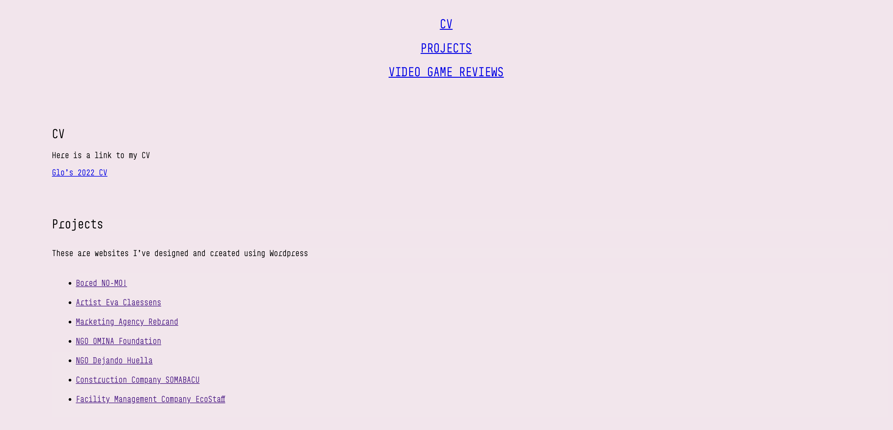

# Glo's Portfolio

# Project Description
This project has 2 objectives:
1. To showcase what I have previously done.
        a. Work experience shown through my CV. 
        b. Website experience through Projects section.

2. To showcase what I have learned so far through the website itself. 

You will see that there are few fun things around the website, make sure to hover around and see things change!

# Links
This is the link to the GitHub Repo: https://github.com/ggggglo/Glos_Portfolio

This is the link to the deployed website: https://ggggglo.github.io/Glos_Portfolio/ 

# Images

This is what the website looks like:

